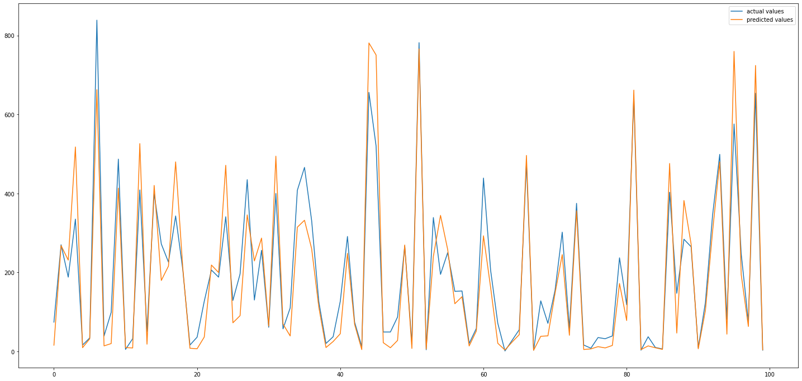
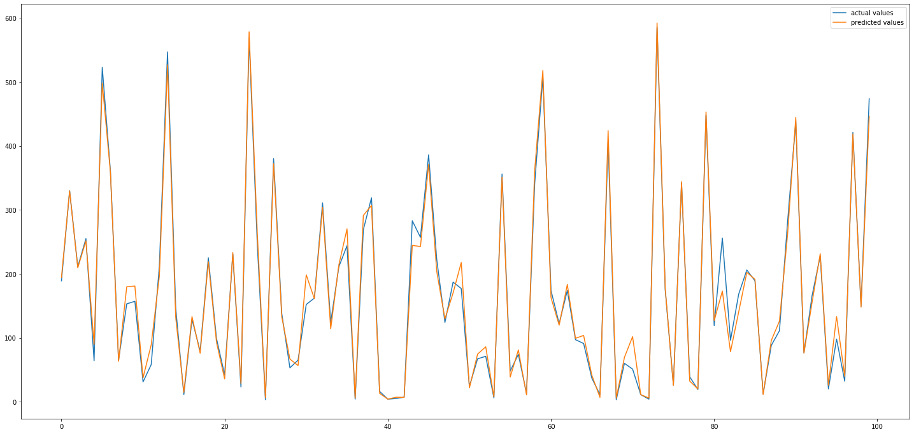

# Bike-Sharing-Demand-autoGluon
- use the AutoGluon library to train several models for the Bike Sharing Demand
- submit the result to kaggle
- Bike-sharing demand is highly relevant to related problems companies encounter, such as Uber, Lyft, and DoorDash. Predicting demand not only helps businesses prepare for spikes in their services but also improves customer experience by limiting delays.
- there is a project for bike-sharing using pytorch nn [predict-bike-sharing-nn](https://github.com/ahmedbadr97/Predicting-Bike-Sharing-Patterns)
  - all the EDA done for this data in this project 
## Initial Training
- training without feature engineering and pass the data to autogluon as it is
- the kaggle score compared to top score were too high, and I calculated the MSE was too high also `71.4868`
### model inference

## some Exploratory data analysis and feature creation
- i found that there is a strong direct correlation between the temp and atemp a removed the temp to speed up training, but the model accuracy didn't improve for the same time for training for both
- i chose to split the datetime to (month,day,hour) and dropped the year data because this will be a unique entry data for certain row, and the model will be useless to relate the unique datetime to the output because it won't be repeated
### results
- the score decreased dramatically
- the reasons for that
  - setting the columns season,weather to categorical columns this will make autogluon encode this features and don't deal with them as integer filed making the model understand that they continuous values, but they are not they are restricted to some values only
  - splitting the datetime to (month,day,hour) and neglecting the year data because he model will be useless to relate the unique datetime to the output because it won't be repeated
### model inference
- 

## Comparison between my [pytoch nn Project](https://github.com/ahmedbadr97/Predicting-Bike-Sharing-Patterns/blob/main/mode_predictions.png)
### pytorch nn
- min test loss was  mean squared error -->`4576` root squared error= `67.646`
### model inference
- 
## Autogluon Model
- min test loss was  root mean squared error -->`19.2`
### model inference
- 